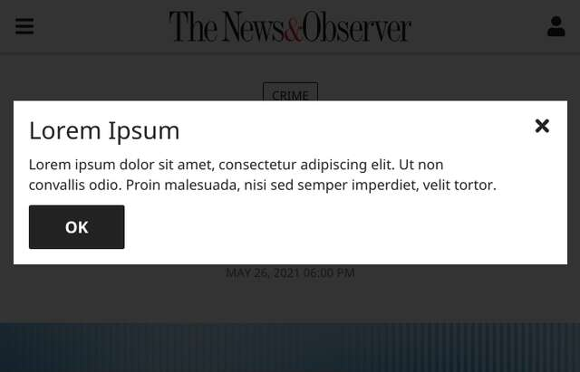
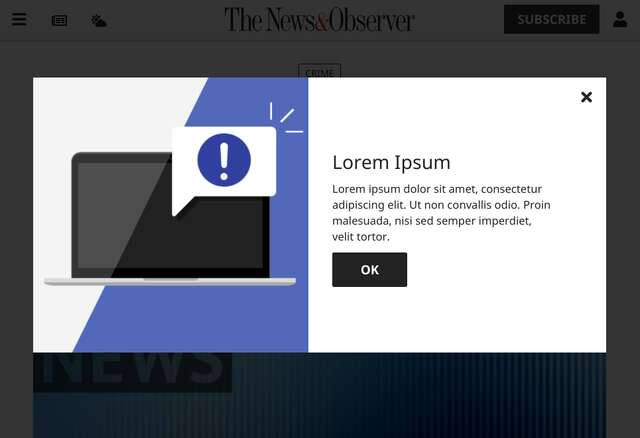

# The dynamic modal

This card displays a modal in SDS style and provides a couple of diffrent display types based on what we need and have available. The ShadowDOM has two slots: one named `image` that will render a cropped version of a photo on the left side if included, and a regular slot that will accept all other LightDOM children.

*Note: a previous version of this card included Adobe Target tracking functionality. This has been replaced with an event-based approach to allow for more varied solutions in the LightDOM.*

## Simple example

```html
<dynamic-modal class="showing" hidden>
  <h3 class="h2">Lorem Ipsum</h3>
  <p>Lorem ipsum dolor sit amet, consectetur adipiscing elit. Ut non convallis odio. Proin malesuada, nisi sed semper imperdiet, velit tortor.</p>
  <a class="button big" href="#">OK</a>
</dynamic-modal>
```

### Mock



## Image example

```html
<dynamic-modal class="showing" hidden>
  
  <h3 class="h2">Lorem Ipsum</h3>
  <p>Lorem ipsum dolor sit amet, consectetur adipiscing elit. Ut non convallis odio. Proin malesuada, nisi sed semper imperdiet, velit tortor.</p>
  <a class="button big" href="#">OK</a>
</dynamic-modal>
```

### Mock



*Notes: the image does not show on screens smaller than 730px.*

## ShadowDOM structure

```html
<div class="screen"></div>
<div class="card">
  <div class="image">
    <slot name="image"></slot>
  </div>
  <div class="package">
    <slot id="main"></slot>
  </div>
  <svg class="close" width="20" height="20" viewBox="0 0 352 512"><path d="M242.72 256l100.07-100.07c12.28-12.28 12.28-32.19 0-44.48l-22.24-22.24c-12.28-12.28-32.19-12.28-44.48 0L176 189.28 75.93 89.21c-12.28-12.28-32.19-12.28-44.48 0L9.21 111.45c-12.28 12.28-12.28 32.19 0 44.48L109.28 256 9.21 356.07c-12.28 12.28-12.28 32.19 0 44.48l22.24 22.24c12.28 12.28 32.2 12.28 44.48 0L176 322.72l100.07 100.07c12.28 12.28 32.2 12.28 44.48 0l22.24-22.24c12.28-12.28 12.28-32.19 0-44.48L242.72 256z"/></svg>
</div>
```

## Configurable classes

**showing**

This is the class that toggles the element visibility. There are methods in the element to do this programmaitcally, but you can also do it yourself. In addition, you can add this class before appending it to the DOM and the element will show once it's been updated.

**requires-action**

This class toggles visibility of the close icon. When added you need to program a close method yourself.

## Custom CSS properties

`--screen-color`: changes the color of the background screen  
`--paper-color`: changes the color of the card  
`--close-color`: changes the color of the close icon  
`--ps`: changes the spacing between children (package space)

## Methods

**open()**

This shows the modal and triggers an `open` event.

**close()**

This closes the modal and triggers a `close` event.

## Events

**open**

Dispatches when the open method is called, or when the element is added or moved in the DOM with the showing class already added. 

**close**

Dispatches when the close method is called, and when the close icon is clicked as it uses that method internally.

