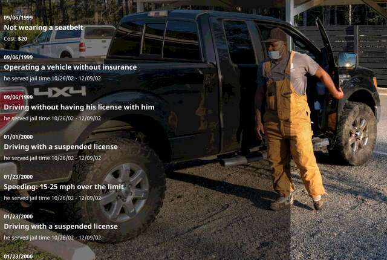

# Fixed media

This card creates a very simple scrollytell experience. The Shadow DOM has two slot layers: fixed and normal. Anything placed in the fixed layer will be sticky as the user scrolls. If an HTML video element is placed in the fixed layer, it will start playing when the top of the element hits the top of the screen. Elements placed in the Light DOM without a slot will go into the overlay layer, which is styled for consistency.

## Example

```html
<fixed-media class="screen">
  
  <p>...</p>
</fixed-media>
```

## Mock



## ShadowDOM structure

```html
<slot name="fixed"></slot>
<slot class="overlay"></slot>
```

## Styling and CSS properties

#### --overlay-screen

The overlay layer does not have the transparent background layer by default. To add it, simply add the `screen` class to the `<fixed-media>` element. You can also change the background color from the default `rgba(0,0,0,0.5)` using the `--overlay-screen` property in the Light DOM.

#### --overlay-align

The default alignment for the overlay is `flex-start` and the maximum width is capped with the `--story-width` property. The overlay uses the CSS grid display, and you can change the alignment using any flexbox setting.

#### --fixed-filter/--fixed-transition

In testing, I tried some animated effects on the fixed layer. Without settling on something standard, I removed that test code. I left in these two properties to allow us to customize the experience further using the Light DOM. On intersetion the element appends an `intersecting` class to itself. You can use this change to pass through different filters or effects.

## Analytics

The element sends two different interactions to Adobe in order to track passive use.

#### fixed-media-visible

This interaction is sent when the top of the element reaches the top of the screen. Normally it would be sent when the top of the element hits the bottom of the screen, but in this case I'm using the same IntersectionObserver that plays the video and we wanted the video to be fully in view before playing.

#### fixed-media-passed

This interaction is sent when the bottom of the element reaches the top of the screen.
